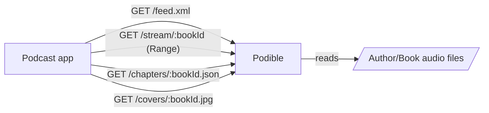

# Podible (Bun audiobook feed)

Simple Bun server that exposes your audiobooks as a single podcast feed.



## Requirements
- Bun
- Audio library laid out as `ROOT/<Author>/<Book>/*.{mp3,m4b,jpg}` (mp3 multi-file or single m4b)
- ffprobe (required for chapter timings)

## Run locally
```bash
bun run server.ts /path/to/library
# example: bun run server.ts /books
```
Subscribe to `http://<host>/feed.xml`.

## Docker
```bash
docker-compose up --build
# or build manually:
docker build -t podible .
docker run -p 80:80 -v ./books:/books:ro podible bun run server.ts /books
```

## Endpoints
- `GET /feed.xml` — RSS with one item per book (enclosure streams audio; chapters tag for mp3 sets).
- `GET /feed-debug.xml` — Same feed with browser-friendly headers for viewing raw XML.
- `GET /stream/:bookId` — Range-aware streaming; handles single m4b or stitched mp3 files.
- `GET /chapters/:bookId.json` — Podcasting 2.0 chapters JSON for multi-mp3 books.
- `GET /chapters-debug/:bookId.json` — Debug view of chapters with `application/json`.
- `GET /covers/:bookId.jpg` — First `.jpg` in the book folder (exposed as a JPEG), if present.

## Notes
- Library is scanned on each request (no persistent index).
- `bookId` is a slug of `author-title` from folder names.
