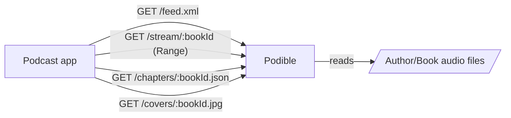

# Podible (Bun audiobook feed)

Simple Bun server that exposes your audiobooks as a single podcast feed.



## Requirements
- Bun
- Audio library laid out as `ROOT/<Author>/<Book>/*.{mp3,m4b,jpg}` (mp3 multi-file or single m4b)
- ffprobe (required for chapter timings)

## Run locally
```bash
bun install
bun run server.ts /path/to/library
# example: bun run server.ts /books
```
Subscribe to `http://<host>/feed.xml`.

## Docker
```bash
docker-compose up --build
# or build manually:
docker build -t podible .
docker run -p 80:80 -v ./books:/books:ro podible bun run server.ts /books
```

## Endpoints
- `GET /` — Minimal homepage showing scan/transcode progress.
- `GET /feed.xml` — RSS with one item per book (enclosure streams audio; chapters tag for mp3 sets).
- `GET /feed-debug.xml` — Same feed with browser-friendly headers for viewing raw XML.
- `GET /epubs/:id.epub` — Serves the first `.epub` found in the book folder (also exposed in the feed via a private `<podible:epub />` tag).
- `GET /stream/:bookId` — Range-aware streaming; handles single m4b or stitched mp3 files.
- `GET /chapters/:bookId.json` — Podcasting 2.0 chapters JSON for multi-mp3 books and m4b files with embedded chapters.
- `GET /chapters-debug/:bookId.json` — Debug view of chapters with `application/json`.
- `GET /covers/:bookId.jpg` — First `.jpg` in the book folder (exposed as a JPEG), if present.

## Authentication
- On first launch Podible writes a random API key to the data directory (`$DATA_DIR` or `${TMPDIR:-/tmp}/podible-transcodes/api-key.txt`) and logs it to the console.
- All endpoints require the key via `?key=<api-key>` (query param). Headers are also accepted for manual testing: `Authorization: Bearer <key>` or `X-API-Key: <key>`.

## Notes
- Single-file m4b books transcode eagerly in the background. The feed only includes titles whose transcodes are finished; as jobs complete, they appear automatically.
- Library is scanned in the background (with fs watch + debounce); feed requests do not trigger transcodes.
- `bookId` is a slug of `author-title` from folder names.
- Multi-MP3 streams are stitched with an in-memory ID3v2.4 chapters tag prepended for chapter-aware players; m4b embedded chapters are exposed via the chapters endpoint/feed tag.
- If a `.opf` file exists in a book folder, its metadata (title, author, description, language, ISBN, publication date) is used to enrich the feed item notes.

## Feed metadata (Apple-friendly)
Environment variables (all optional, with defaults):
- `POD_TITLE` (default: `Podible Audiobooks`)
- `POD_DESCRIPTION` (default: `Podcast feed for audiobooks`)
- `POD_LANGUAGE` (default: `en-us`)
- `POD_COPYRIGHT`
- `POD_AUTHOR` (default: `Unknown`)
- `POD_OWNER_NAME` (default: `Owner`)
- `POD_OWNER_EMAIL` (default: `owner@example.com`)
- `POD_EXPLICIT` (`yes`|`no`|`clean`, default: `no`)
- `POD_CATEGORY` (default: `Arts`)
- `POD_TYPE` (`episodic`|`serial`, default: `episodic`)
- `POD_IMAGE_URL` (optional; falls back to first cover URL if available)

Items include link, pubDate, explicit flag, duration, and descriptions for validator compatibility. Enclosure lengths include the prepended ID3 chapters tag for multi-MP3 books.
